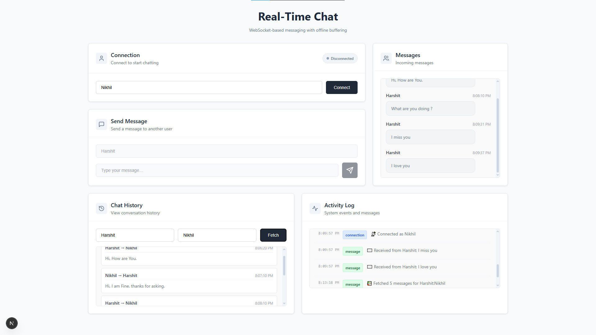
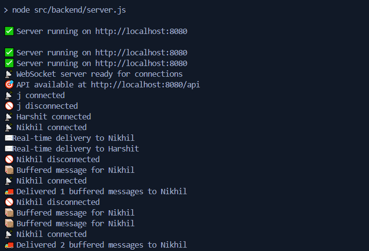

# Real-Time Chat Application (Backend System)




A WebSocket-based real-time chat backend system with offline message buffering, built with Node.js, Express, and WebSocket. This system enables seamless messaging between users with guaranteed message delivery and ordering, even during disconnections.

## 🎯 Problem Statement

Design and implement a minimal real-time chat backend that enables two users to exchange messages via WebSocket connections, supporting both real-time messaging and offline message delivery for a seamless user experience.

## 🎥 Demo Video  
[](https://youtu.be/a1DkqtqWmPg)

---

## 🔧 Functional Requirements Implementation

### 1. Real-Time Messaging via WebSocket
- **Implementation**: WebSocket server on port 8080 using the `ws` library
- **Connection**: Users connect via `ws://localhost:8080?userId=USERNAME`
- **Message Format**: JSON messages with `type: "chat"`, `to`, and `content` fields
- **Instant Delivery**: Messages are delivered immediately if both users are online

### 2. Offline Message Handling
- **Buffering**: Messages for offline users are stored in `messageQueue` Map
- **Auto-Delivery**: Buffered messages are automatically delivered when users reconnect
- **Ordering**: Messages are delivered in the exact order they were sent using Arrays

### 3. Message Acknowledgment
- **ACK Response**: Every sent message receives an acknowledgment with message ID
- **Format**: `{ ack: messageId, type: "ack" }`
- **Logging**: All acknowledgments are logged for debugging

### 4. Chat History Retrieval
- **REST Endpoint**: `GET /api/messages?user1=A&user2=B`
- **Storage**: Chat history stored in `chatHistory` Map with sorted user keys
- **Response**: JSON array of messages with timestamps, sorted chronologically

### 5. Guaranteed Message Ordering
- **Thread Safety**: Async mutex locks ensure atomic operations
- **Sequential Processing**: Messages are processed one at a time per conversation
- **Ordered Storage**: Arrays maintain insertion order for both history and queues

## 🏗️ System Architecture

```
┌─────────────────┐    ┌──────────────────┐    ┌─────────────────┐
│   WebSocket     │    │   In-Memory      │    │   REST API      │
│   Server        │◄──►│   Storage        │◄──►│   Server        │
│   (Port 8080)   │    │   - chatHistory  │    │   /api/messages │
│                 │    │   - messageQueue │    │                 │
│                 │    │   - connections  │    │                 │
└─────────────────┘    └──────────────────┘    └─────────────────┘
```

### Data Structures
- **`chatHistory`**: Map<string, Message[]> - Stores all messages by chat key
- **`messageQueue`**: Map<string, Message[]> - Buffers messages for offline users
- **`activeConnections`**: Map<string, WebSocket> - Tracks online users
- **`messageLock`**: AsyncMutex - Ensures thread-safe operations

## 🚀 Getting Started

### Prerequisites
- Node.js (v16 or higher)
- npm or yarn

### Installation

1. **Clone the repository**
   ```bash
   git clone https://github.com/Harshit-Dhundale/Real-Time-Chat-Application.git
   cd realtime-chat
   ```

2. **Install dependencies**
   ```bash
   npm install
   ```

3. **Start the backend server**
   ```bash
   npm run backend
   ```
   You should see:
   ```
   ✅ Server running on http://localhost:8080
   📡 WebSocket server ready for connections
   🎯 API available at http://localhost:8080/api
   ```

4. **Start the frontend (in a new terminal)**
   ```bash
   npm run dev
   ```
   Frontend will be available at: http://localhost:3000

## 📋 Usage Instructions

### Basic Setup
1. Open http://localhost:3000 in your browser
2. Enter a username and click "Connect"
3. Open another browser tab/window for the second user
4. Connect with a different username

### Sending Messages
1. Enter recipient username in "Send Message" section
2. Type your message and click send or press Enter
3. Message will appear instantly in recipient's "Messages" section

## 🧪 Demonstration Scripts

### 1. Real-Time Chat Between Two Users

**Step 1: Connect User A**
```bash
# Open browser tab 1: http://localhost:3000
# Username: Harshit
# Click "Connect"
# Expected log: "📡 Harshit connected"
```

**Step 2: Connect User B**
```bash
# Open browser tab 2: http://localhost:3000
# Username: Nikhil
# Click "Connect"
# Expected log: "📡 Nikhil connected"
```

**Step 3: Send Messages**
```bash
# In Harshit's tab:
# Recipient: Nikhil
# Message: "Hello Nikhil!"
# Click Send
# Expected: Message appears instantly in Nikhil's "Messages" section
# Expected log: "✉️ Real-time delivery to Nikhil"

# In Nikhil's tab:
# Recipient: Harshit
# Message: "Hi Harshit!"
# Click Send
# Expected: Message appears instantly in Harshit's "Messages" section
```

### 2. Disconnection and Reconnection Scenario

**Step 1: Disconnect User B**
```bash
# In Nikhil's tab, click "Disconnect"
# Expected log: "🚫 Nikhil disconnected"
```

**Step 2: Send Messages to Offline User**
```bash
# In Harshit's tab:
# Send message: "Are you there?"
# Send message: "This is message 2"
# Expected logs: 
# "📦 Buffered message for Nikhil"
# "📦 Buffered message for Nikhil"
```

**Step 3: Reconnect User B**
```bash
# In Nikhil's tab:
# Username: Nikhil
# Click "Connect"
# Expected logs:
# "📡 Nikhil connected"
# "🚚 Delivered 2 buffered messages to Nikhil"
# Expected: Both messages appear in Nikhil's interface in correct order
```

### 3. Chat History Retrieval via REST

**Method 1: Using the Frontend**
```bash
# In any browser tab:
# Go to "Chat History" section
# User 1: Harshit
# User 2: Nikhil
# Click "Fetch"
# Expected: All messages between Harshit and Nikhil appear chronologically
```

**Method 2: Direct API Call**
```bash
# Using curl:
curl "http://localhost:8080/api/messages?user1=Harshit&user2=Nikhil"

# Expected response:
{
  "chatKey": "Harshit:Nikhil",
  "messages": [
    {
      "id": "1640995200000",
      "from": "Harshit",
      "to": "Nikhil",
      "content": "Hello Nikhil!",
      "timestamp": "2023-12-31T12:00:00.000Z"
    },
    {
      "id": "1640995201000",
      "from": "Nikhil",
      "to": "Harshit",
      "content": "Hi Harshit!",
      "timestamp": "2023-12-31T12:00:01.000Z"
    }
  ]
}
```

**Method 3: Using Browser**
```bash
# Open: http://localhost:8080/api/messages?user1=Harshit&user2=Nikhil
# View JSON response in browser
```

## 🔍 Testing Scenarios

### Scenario 1: Message Ordering Test
```bash
1. Connect Harshit and Nikhil
2. Disconnect Nikhil
3. Harshit sends: "Message 1", "Message 2", "Message 3"
4. Reconnect Nikhil
5. Verify Nikhil receives all messages in order: 1, 2, 3
```

### Scenario 2: Concurrent Users Test
```bash
1. Connect multiple users: Harshit, Nikhil, Charlie
2. Send messages between different pairs
3. Verify each user only receives their intended messages
4. Check chat history for each pair is separate
```

### Scenario 3: Server Restart Test
```bash
1. Connect users and send messages
2. Restart backend server (Ctrl+C, then npm run backend)
3. Note: In-memory data is lost (as per requirements)
4. Reconnect users and verify fresh start
```

## 📊 API Endpoints

### WebSocket Connection
- **URL**: `ws://localhost:8080?userId=USERNAME`
- **Protocol**: WebSocket
- **Message Format**:
  ```json
  {
    "type": "chat",
    "to": "recipient_username",
    "content": "message content"
  }
  ```

### REST API
- **GET** `/api/messages?user1=A&user2=B` - Get chat history
- **GET** `/api/status` - Get server status and active connections
- **GET** `/health` - Health check endpoint

## 🔒 Thread Safety & Concurrency

- **Async Mutex Locks**: All message operations use `async-mutex` for thread safety
- **Atomic Operations**: Message storage and delivery are atomic
- **Connection Management**: WebSocket connections are safely managed in concurrent scenarios
- **Queue Processing**: Message queues are processed sequentially to maintain order

## 📝 Logging System

The system provides comprehensive logging for all key events:

- **📡 Connection**: User connects/disconnects
- **✉️ Real-time delivery**: Message delivered instantly
- **📦 Buffered message**: Message stored for offline user
- **🚚 Delivered buffered**: Offline messages delivered on reconnect
- **✅ Acknowledgment**: Message acknowledgment sent
- **⛔ Error**: Any system errors

## 🏃‍♂️ Quick Start Commands

```bash
# Install dependencies
npm install

# Start backend only
npm run backend

# Start frontend only
npm run dev

# Start backend with auto-reload (development)
npm run backend:dev
```

## 🧪 Testing the System

1. **Real-time messaging**: Send messages between connected users
2. **Offline handling**: Disconnect a user, send messages, reconnect
3. **Message ordering**: Send multiple messages to offline user
4. **Chat history**: Use REST API to retrieve conversation history
5. **Concurrent users**: Test with multiple users simultaneously

## 🔧 Configuration

- **Backend Port**: 8080 (configurable via PORT environment variable)
- **Frontend Port**: 3000 (Next.js default)
- **WebSocket URL**: ws://localhost:8080
- **API Base URL**: http://localhost:8080/api

## 📁 Project Structure

```
realtime-chat/
├── src/backend/
│   ├── server.js          # Main server entry point
│   ├── websocket.js       # WebSocket connection handling
│   ├── storage.js         # In-memory data structures
│   └── rest-api.js        # REST API endpoints
├── app/
│   ├── page.tsx           # React frontend
│   └── globals.css        # Styling
├── scripts/
│   └── dev-setup.js       # Development setup script
├── package.json           # Dependencies and scripts
└── README.md              # This file
```

## 🎯 Success Criteria Met

✅ **Real-time message delivery** - Messages delivered instantly when users online  
✅ **Offline message buffering** - Messages stored and delivered on reconnect  
✅ **Message acknowledgments** - Every message receives ACK response  
✅ **Chat history API** - REST endpoint returns full conversation history  
✅ **Message ordering** - Guaranteed delivery order using Arrays and mutex locks  
✅ **Thread safety** - Async mutex ensures concurrent operation safety  
✅ **In-memory storage** - No external databases, only Maps and Arrays  
✅ **Comprehensive logging** - All events tracked with emoji indicators  
✅ **Robust reconnection** - Handles disconnection/reconnection gracefully  

## 🚀 Bonus Features Implemented

- **Modern React Frontend** - Clean UI for testing and demonstration
- **Comprehensive Logging** - Emoji-based event tracking system
- **Real-time Activity Log** - Live view of all system events
- **Connection Status** - Visual indicators for user connection state
- **Error Handling** - Graceful error handling and user feedback
- **Responsive Design** - Works on desktop and mobile devices

---

**Built with ❤️ using Node.js, Express, WebSocket, and React**
